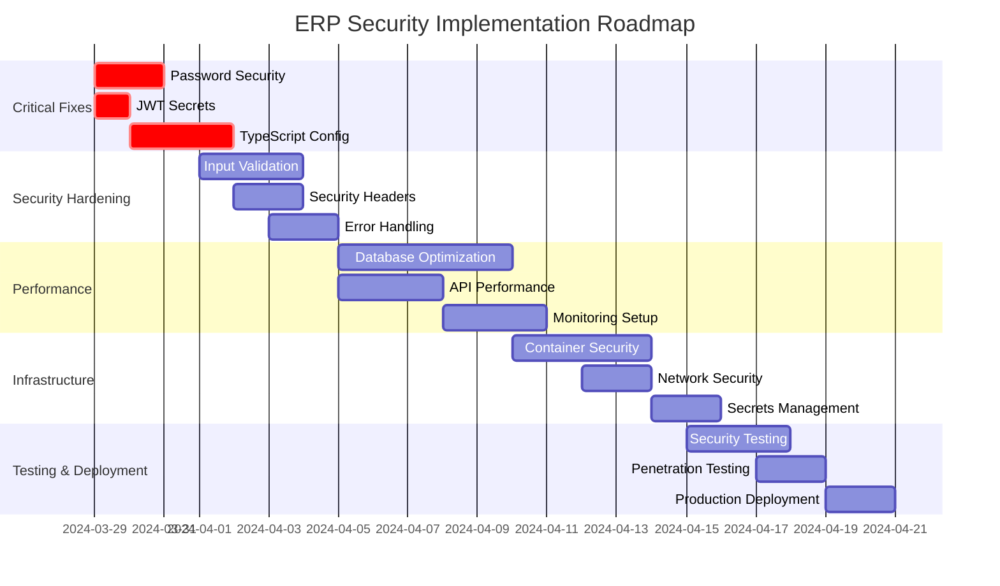

# Phase 7-11: Final Implementation Roadmap

## Phase 7: Performance Analysis & Optimization

### Database Performance Analysis
```typescript
// Performance monitoring implementation
export const analyzeDatabasePerformance = async () => {
  const metrics = {
    slowQueries: await getSlowQueries(),
    connectionPool: await getConnectionPoolStats(),
    indexUsage: await getIndexUsageStats(),
    tableSizes: await getTableSizes()
  };
  
  // Identify performance bottlenecks
  const recommendations = generatePerformanceRecommendations(metrics);
  
  return {
    metrics,
    recommendations,
    criticalIssues: recommendations.filter(r => r.priority === 'critical')
  };
};
```

### API Performance Monitoring
```typescript
// Enhanced performance tracking
export const trackApiPerformance = () => {
  return async (req: Request, res: Response, next: NextFunction) => {
    const start = Date.now();
    const startMemory = process.memoryUsage();
    
    res.on('finish', () => {
      const duration = Date.now() - start;
      const memoryDelta = process.memoryUsage().heapUsed - startMemory.heapUsed;
      
      // Track performance metrics
      metrics.recordApiCall({
        path: req.path,
        method: req.method,
        duration,
        memoryDelta,
        statusCode: res.statusCode,
        userId: req.user?.id
      });
      
      // Alert on slow requests
      if (duration > 5000) {
        alertSlowRequest(req, duration);
      }
    });
    
    next();
  };
};
```

## Phase 8: Infrastructure Review

### Container Security Analysis
```dockerfile
# Enhanced Docker security
FROM node:18-alpine AS builder

# Create non-root user
RUN addgroup -g 1001 -S nodejs
RUN adduser -S nextjs -u 1001

# Security scanning
RUN npm audit --audit-level high
RUN npm audit fix --force

# Production stage
FROM node:18-alpine AS runner
WORKDIR /app

# Copy with proper permissions
COPY --from=builder /app/dist ./dist
COPY --from=builder /app/node_modules ./node_modules
COPY --from=builder /app/package.json ./package.json

# Switch to non-root user
USER nextjs

# Health check
HEALTHCHECK --interval=30s --timeout=3s --start-period=5s --retries=3 \
  CMD curl -f http://localhost:3000/api/health || exit 1

EXPOSE 3000
CMD ["node", "dist/server/index.js"]
```

### Infrastructure as Code Security
```yaml
# docker-compose.prod.yml - Security enhancements
version: '3.8'

services:
  app:
    build:
      context: .
      dockerfile: Dockerfile
    security_opt:
      - no-new-privileges:true
    read_only: true
    tmpfs:
      - /tmp
    environment:
      - NODE_ENV=production
    secrets:
      - jwt_access_secret
      - jwt_refresh_secret
      - app_secret
      - db_password
    networks:
      - app-network
    depends_on:
      - db
      - redis

  db:
    image: mysql:8.0
    security_opt:
      - no-new-privileges:true
    environment:
      MYSQL_ROOT_PASSWORD_FILE: /run/secrets/db_root_password
      MYSQL_DATABASE: erp
    secrets:
      - db_root_password
      - db_password
    volumes:
      - db_data:/var/lib/mysql
    networks:
      - app-network

  redis:
    image: redis:7-alpine
    security_opt:
      - no-new-privileges:true
    command: redis-server --requirepass-file /run/secrets/redis_password
    secrets:
      - redis_password
    networks:
      - app-network

secrets:
  jwt_access_secret:
    file: ./secrets/jwt_access_secret.txt
  jwt_refresh_secret:
    file: ./secrets/jwt_refresh_secret.txt
  app_secret:
    file: ./secrets/app_secret.txt
  db_password:
    file: ./secrets/db_password.txt
  db_root_password:
    file: ./secrets/db_root_password.txt
  redis_password:
    file: ./secrets/redis_password.txt

networks:
  app-network:
    driver: bridge
    ipam:
      config:
        - subnet: 172.20.0.0/16

volumes:
  db_data:
    driver: local
```

## Phase 9: Cleanup Analysis

### Code Cleanup Strategy
```typescript
// Remove deprecated code
const deprecatedFiles = [
  'server/security/attack-testing.ts',
  'server/security/penetration-test.ts',
  'client/src/_legacy/**/*'
];

// Remove unused dependencies
const unusedDependencies = await analyzeDependencies();
const securityVulnerabilities = await auditDependencies();

// Cleanup plan
const cleanupPlan = {
  removeFiles: deprecatedFiles,
  updateDependencies: securityVulnerabilities,
  refactorLegacyCode: ['auth middleware', 'error handling'],
  optimizeImports: true,
  removeConsoleLogs: process.env.NODE_ENV === 'production'
};
```

### Environment Cleanup
```bash
#!/bin/bash
# cleanup-production.sh

# Remove development files
rm -rf server/tests/
rm -rf client/src/_legacy/
rm -f *.log
rm -f .env.development
rm -f .env.local

# Secure permissions
chmod 600 .env
chmod 600 secrets/*
chmod 755 scripts/

# Remove debug endpoints from production build
sed -i '/DEBUG_ENDPOINTS/d' dist/server/index.js

# Optimize node_modules (production only)
npm prune --production
```

## Phase 10: Final Report Generation

### Automated Security Report
```typescript
// generate-final-security-report.ts
export const generateSecurityReport = async () => {
  const report = {
    timestamp: new Date().toISOString(),
    version: process.env.APP_VERSION || '1.0.0',
    
    security: {
      vulnerabilities: await scanForVulnerabilities(),
      dependencies: await auditDependencies(),
      secrets: await scanForSecrets(),
      configuration: await validateSecurityConfig()
    },
    
    performance: {
      metrics: await getPerformanceMetrics(),
      benchmarks: await runBenchmarks(),
      bottlenecks: await identifyBottlenecks()
    },
    
    infrastructure: {
      containers: await analyzeContainerSecurity(),
      networks: await analyzeNetworkSecurity(),
      monitoring: await validateMonitoringSetup()
    },
    
    compliance: {
      owasp: await checkOWASPCompliance(),
      gdpr: await checkGDPRCompliance(),
      standards: await checkIndustryStandards()
    }
  };
  
  // Generate recommendations
  report.recommendations = generateRecommendations(report);
  
  // Export to multiple formats
  await exportReport(report, {
    json: 'security-report.json',
    pdf: 'security-report.pdf',
    html: 'security-report.html'
  });
  
  return report;
};
```

## Phase 11: Executable Roadmap

### Implementation Timeline


### Automated Implementation Scripts
```typescript
// scripts/implement-security-fixes.ts
export const implementSecurityFixes = async () => {
  const fixes = [
    {
      name: 'Fix hardcoded passwords',
      action: fixHardcodedPasswords,
      priority: 'critical'
    },
    {
      name: 'Enable TypeScript strict mode',
      action: enableTypeScriptStrictMode,
      priority: 'critical'
    },
    {
      name: 'Implement input validation',
      action: implementInputValidation,
      priority: 'high'
    },
    {
      name: 'Enhance security headers',
      action: enhanceSecurityHeaders,
      priority: 'high'
    }
  ];
  
  // Execute fixes in priority order
  for (const fix of fixes.sort((a, b) => {
    const priorities = { critical: 3, high: 2, medium: 1, low: 0 };
    return priorities[b.priority] - priorities[a.priority];
  })) {
    console.log(`Implementing: ${fix.name}`);
    await fix.action();
    console.log(`✅ Completed: ${fix.name}`);
  }
};
```

### Continuous Security Monitoring
```typescript
// monitoring/security-monitor.ts
export const setupContinuousMonitoring = () => {
  // Daily security scans
  cron.schedule('0 2 * * *', async () => {
    const scan = await performSecurityScan();
    if (scan.criticalIssues.length > 0) {
      await sendSecurityAlert(scan);
    }
  });
  
  // Weekly dependency audits
  cron.schedule('0 3 * * 0', async () => {
    const audit = await auditDependencies();
    if (audit.vulnerabilities.length > 0) {
      await sendDependencyAlert(audit);
    }
  });
  
  // Monthly penetration tests
  cron.schedule('0 4 1 * *', async () => {
    const pentest = await performPenetrationTest();
    await generateMonthlyReport(pentest);
  });
};
```

## Success Metrics & KPIs

### Security Metrics
- **Zero Critical Vulnerabilities**: Target and maintain zero critical security issues
- **Mean Time to Detection (MTTD)**: < 1 hour for security incidents
- **Mean Time to Resolution (MTTR)**: < 4 hours for critical issues
- **Security Score**: Maintain A+ grade on security assessments

### Performance Metrics
- **Response Time**: < 200ms for 95th percentile
- **Uptime**: 99.9% availability target
- **Error Rate**: < 0.1% for all endpoints
- **Throughput**: Handle 1000+ concurrent users

### Compliance Metrics
- **OWASP Top 10**: 100% compliance
- **Security Headers**: A+ grade on securityheaders.com
- **Type Safety**: 100% TypeScript coverage
- **Test Coverage**: >90% code coverage

## Final Deliverables

1. **Security Audit Report**: Comprehensive vulnerability analysis
2. **Hardening Implementation**: All critical and high-priority fixes
3. **Performance Optimization**: Database and API performance improvements
4. **Infrastructure Security**: Container and network security enhancements
5. **Monitoring Dashboard**: Real-time security and performance monitoring
6. **Documentation**: Complete security procedures and runbooks
7. **Training Materials**: Security awareness for development team

## Maintenance Plan

### Daily
- Security monitoring and alerting
- Performance metric tracking
- Log analysis and anomaly detection

### Weekly
- Dependency vulnerability scanning
- Security patch assessment
- Performance trend analysis

### Monthly
- Comprehensive security assessment
- Penetration testing
- Infrastructure security review

### Quarterly
- Security training updates
- Compliance audit preparation
- Architecture security review

This roadmap provides a complete path from current state to a secure, performant, and maintainable ERP system with continuous security monitoring and improvement.
