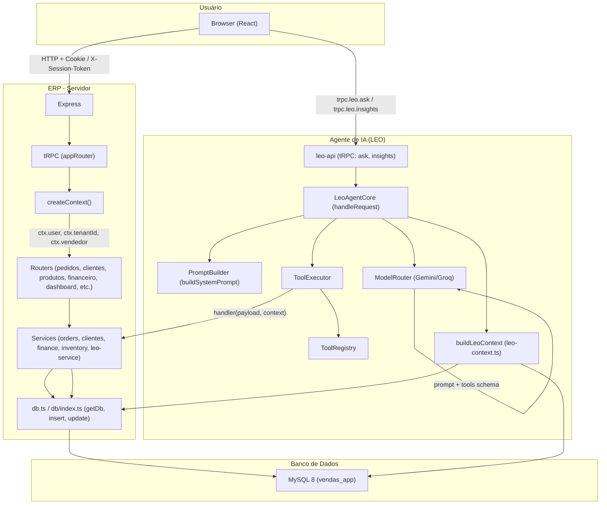

# AUDITORIA EXAUSTIVA — ERP + LEO (Deep Scan)

**Data:** 2026-03-16  
**Escopo:** 100% do diretório do projeto (server, client, shared, drizzle, scripts, docs).  
**Pilares:** 6 (Estrutura, Anti-any, RobotJS, Fantasmas/Segurança, Deploy, Manutenção Zero).

---

# 1. MAPA ESTRUTURAL E INVENTÁRIO

## 1.1 Tabela [Ferramenta/Lib] | [Função Resumida] | [Risco de Quebra/Status]

| Ferramenta/Lib | Função Resumida | Risco de Quebra/Status |
|----------------|-----------------|------------------------|
| **Node.js + TypeScript** | Runtime e tipagem do backend e build | Médio: tsconfig.server com strict: false e strictNullChecks: false |
| **Express** | Servidor HTTP, middlewares, CORS, rate limit | Baixo: uso estável |
| **tRPC v11** | API type-safe (procedures), createContext, appRouter | Baixo: bem integrado |
| **Drizzle ORM** | Acesso a MySQL (schema, queries, migrations) | Médio: múltiplos pontos com (tx as any) e inserts sem tipo |
| **MySQL2** | Driver MySQL para Node | Baixo |
| **React 19 + Vite** | Frontend SPA, build, HMR | Baixo |
| **TanStack Query + tRPC React** | Cache e queries no client (trpc.xxx.useQuery) | Baixo |
| **Zod** | Validação de input em procedures e forms | Baixo |
| **Wouter** | Roteamento client-side | Baixo |
| **Zustand** | Estado global (auth) no client | Baixo |
| **robotjs** | Controle de mouse/teclado para automação LEO | **ALTO: não está em package.json; require() dinâmico; falha em Node 18+ e ambientes sem display** |
| **@nut-tree/nut-js** | Alternativa a robotjs (referenciada em config, não instalada) | N/A: não instalado |
| **playwright** | Automação de browser (referenciada em config) | N/A: não instalado no root package.json |
| **jose** | JWT (sign/verify) para sessão | Baixo |
| **cookie** | Parse de cookies no createContext | Baixo |
| **nanoid** | IDs únicos (traceId, etc.) | Baixo |
| **bcryptjs** | Hash de senhas | Baixo |
| **Sentry** | Monitoramento de erros | Baixo (opcional) |
| **Pino** | Logging estruturado | Baixo |
| **drizzle-kit** | Push/migrate do schema | Médio: conflitos com estado do banco (ex.: audit_log PK) |
| **esbuild** | Bundle do server para produção | Baixo |
| **Recharts** | Gráficos no dashboard LEO | Baixo |
| **Radix UI** | Componentes acessíveis (client) | Baixo |
| **Tailwind CSS** | Estilos | Baixo |
| **archiver** | Backup ZIP | Baixo |
| **AWS SDK (S3)** | Storage (se configurado) | Baixo |
| **axios** | HTTP client em integrações | Baixo |

## 1.2 Diagrama de fluxo de dados (Mermaid)



## 1.3 Comunicação ERP ↔ Agente (detalhada)

- **Canal:** tRPC sobre Express (`/api/trpc`). O front chama procedures como `trpc.leo.ask`, `trpc.leo.insights`, `trpc.dashboard.insights`, etc.
- **Contexto:** `createContext` (server/_core/context.ts) lê cookie/header/bearer, resolve usuário/vendedor e define `ctx.user`, `ctx.tenantId`, `ctx.vendedor`. O LEO usa esse contexto para tenant e permissões.
- **APIs/Hooks/Services:**
  - **LEO → ERP:** O agente não acessa o banco direto. Ele chama **Tools** registradas no `ToolRegistry`; cada tool tem um `handler` que recebe `(payload, context)` e internamente usa **services** (ex.: orders, clientes, inventory) ou **db** (getDb, inserts). Ex.: tool `listarClientes` → handler que chama serviço de clientes → getDb + select.
  - **Contexto do LEO:** `buildLeoContext` (server/leo/utils/leo-context.ts) usa `getDb()` e consultas Drizzle para montar métricas (pedidosHoje, estoqueBaixo, etc.) e alimentar o prompt/decision do agente.
  - **Fluxo de uma pergunta:** Browser → trpc.leo.ask → LeoAPI (routers/leo-api.ts) → requireTenant + leoAgentCore.handleRequest → buildPrompt (inclui contexto) → modelRouter.getResponse (Gemini/Groq) → planActions → toolExecutor.executeTool para cada tool call → handlers que usam services/db → resposta final ao usuário.

---

# 2. OPERAÇÃO 'ANTI-ANY' E BLINDAGEM DE TIPOS

## 2.1 Configuração TypeScript atual

- **tsconfig.json (raiz):** `strict: true`, `noImplicitAny: false`.
- **tsconfig.server.json:** `strict: false`, `noImplicitAny: false`, `strictNullChecks: false`.

Isso permite `any` implícito e tipos fracos no server.

## 2.2 Arquivos com `any` ou tipos implícitos (amostra crítica)

Lista não exaustiva (ocorrências em dezenas de arquivos):

| Arquivo | Ocorrências (ex.) | Ação sugerida |
|---------|-------------------|----------------|
| server/routers.ts | (tx as any), (res as any), (input as any), (p: any) | Tipar tx como Drizzle transaction type; input com Zod infer; filtros com tipos do schema |
| server/db.ts | getInsertId(result: any), vários (tx as any) | Usar tipo do retorno do driver (ResultSetHeader); tipo genérico para transação |
| server/leo/actions/leo-desktop-control.ts | let robot: any; (robot as any).getScreenSize() | Tipo do robotjs em global.d.ts ou módulo; interface ScreenSize |
| server/leo/actions/leo-computer-control.ts | getRobot(): Promise<any>, dados: any | Retornar tipo RobotJS da declaração; dados: Record<string, unknown> |
| server/leo/agent/tool-executor.ts | input: any, data?: any, sanitizeInput(input: any): any | input: unknown; data: unknown ou ToolResult; sanitize: (input: unknown) => Record<string, unknown> |
| server/leo/agent/model-router.ts | tools?: any[] | tools: ToolDefinition[] ou tipo do schema das tools |
| server/leo/security/leo-permissions.ts | sanitizeParameters(parameters: any): any | parameters: unknown; retorno: Record<string, unknown> |
| server/services/leo-service.ts | (resultPedido as any)[0]?.insertId, filtros (p: any) | Tipo de retorno do insert (ResultSetHeader); tipo do item do array |
| server/modules/safe-order.module.ts | (orderData as any), (itemResult as any) | Interfaces OrderData, ItemResult explícitas |
| server/services/audit-service.ts | (rows as any[]), (r as any) | Tipar rows como array de tipo linha do select |
| client/src/components/ai/LeoDashboard.tsx | (c: any), (p: any) | Tipos Cliente e Produto (importados ou definidos) |
| client/src/pages/Estoque.tsx, ContasReceber.tsx, etc. | (x: any) em map/filter | Usar tipos retornados por trpc (inferidos) ou interfaces locais |

## 2.3 Exemplo de refatoração (tool-executor)

**Antes:**

```ts
// server/leo/agent/tool-executor.ts
export interface ToolExecutionResult {
  data?: any;
  // ...
}
async executeTool(toolName: string, input: any, context: ToolExecutionContext): Promise<ToolExecutionResult> {
  // ...
  const validationResult = tool.inputSchema.safeParse(input);
  // ...
  (e: any) => ...
}
private sanitizeInput(input: any): any {
  const sanitized = { ...input };
  // ...
}
```

**Depois:**

```ts
export interface ToolExecutionResult {
  success: boolean;
  data?: unknown;
  error?: string;
  executionTime: number;
  toolName: string;
}

async executeTool(
  toolName: string,
  input: unknown,
  context: ToolExecutionContext
): Promise<ToolExecutionResult> {
  const validationResult = tool.inputSchema.safeParse(input);
  // ...
  const errorMessages = validationResult.error.issues
    .map((e: { path: (string | number)[]; message: string }) => `${e.path.join('.')}: ${e.message}`)
    .join(', ');
}

private sanitizeInput(input: unknown): Record<string, unknown> {
  if (input == null || typeof input !== 'object') return {};
  const sanitized = { ...(input as Record<string, unknown>) };
  const SENSITIVE_KEYS = ['password', 'senha', 'token', 'apiKey'];
  for (const field of SENSITIVE_KEYS) {
    if (field in sanitized) sanitized[field] = '***MASKED***';
  }
  return sanitized;
}
```

## 2.4 Configuração strict recomendada (tsconfig.server.json)

```json
{
  "compilerOptions": {
    "strict": true,
    "noImplicitAny": true,
    "strictNullChecks": true,
    "strictFunctionTypes": true,
    "strictBindCallApply": true,
    "noUnusedLocals": true,
    "noUnusedParameters": true
  }
}
```

Introduzir em etapas: primeiro `strictNullChecks: true` e corrigir null/undefined; depois `noImplicitAny: true` e substituir `any` por `unknown` ou tipos concretos.

---

# 3. DIAGNÓSTICO DO ROBOTJS (GARGALO)

## 3.1 Por que o RobotJS está falhando

- **Não está no package.json:** O projeto não declara `robotjs` nas dependências; o código usa `require('robotjs')` ou `import('robotjs')`. Em ambiente limpo, o módulo não existe.
- **Build nativo:** RobotJS usa addons nativos (C++). Exige:
  - Node-gyp, Python, build tools (Visual Studio Build Tools no Windows);
  - Compatibilidade com a versão do Node (ex.: Node 18+ pode exigir rebuild).
- **Ambiente sem display:** Em servidores (Linux sem X11, Docker sem display, VPS headless), robotjs não consegue controlar mouse/teclado. Ele depende de ambiente gráfico.
- **TypeScript:** O projeto declara `robotjs` em `types/global.d.ts` e `server/leo/types/robot.d.ts`, mas o pacote não está instalado, então o runtime falha antes da tipagem.

## 3.2 Onde é usado

- server/leo/actions/leo-desktop-control.ts (getRobot, moveMouse, click, typeString, etc.)
- server/leo/actions/leo-computer-control.ts (getRobot(), logAction com dados: any)
- server/leo/plugins/desktop-plugin.ts (initializeRobotJS com import('robotjs'))
- server/leo/security/leo-desktop-sandbox.ts (isRobotJSAvailable: require('robotjs'))
- server/leo/operator/leo-operator-mode.ts (mensagem "Controle de computador (robotjs)")
- server/scripts/install-leo-dependencies.ts (lista robotjs como dependência a instalar)
- server/leo/actions/desktop-automation-config.ts (config.robotjs, instruções de instalação)

## 3.3 Alternativa: nut.js (@nut-tree/nut-js)

- **Vantagens:** TypeScript nativo, API mais moderna, suporte a image search (OpenCV), melhor manutenção.
- **Desvantagens:** OpenCV opcional para image; em ambiente headless continua limitado para controle de mouse/teclado “físico”.

Refatoração sugerida para uma função crítica (ex.: mover mouse) usando nut.js:

**Antes (robotjs):**

```ts
// server/leo/actions/leo-desktop-control.ts
async moverMouse(x: number, y: number): Promise<{ success: boolean; message: string }> {
  const robot = await getRobot();
  const screenSize = (robot as any).getScreenSize();
  if (x < 0 || x > screenSize.width || y < 0 || y > screenSize.height) {
    return { success: false, message: `Posição inválida. Tela: ${screenSize.width}x${screenSize.height}` };
  }
  (robot as any).moveMouse(x, y);
  return { success: true, message: 'Mouse movido' };
}
```

**Depois (nut.js):**

```ts
// Instalação: pnpm add @nut-tree/nut-js
import { mouse, screen } from '@nut-tree/nut-js';

async function moverMouse(x: number, y: number): Promise<{ success: boolean; message: string }> {
  try {
    const { width, height } = await screen.width() && await screen.height();
    if (x < 0 || x > width || y < 0 || y > height) {
      return { success: false, message: `Posição inválida. Tela: ${width}x${height}` };
    }
    await mouse.setPosition({ x, y });
    return { success: true, message: 'Mouse movido' };
  } catch (e) {
    const msg = e instanceof Error ? e.message : String(e);
    return { success: false, message: `nut.js: ${msg}` };
  }
}
```

- Manter robotjs como fallback opcional (try/catch) e usar nut.js quando disponível, ou migrar totalmente para nut.js e marcar robotjs como deprecated no código.

---

# 4. CAÇA AOS FANTASMAS (ERROS E SEGURANÇA)

## 4.1 Promises sem .catch

Vários arquivos usam `async`/Promise sem try/catch ou .catch explícito; o tratamento fica no chamador ou em handlers globais. Exemplos de arquivos com muitas chamadas async e risco de rejeição não tratada localmente:

- server/leo/engine/leo-loop.ts
- server/leo/core/task-queue.ts
- server/leo/memory/leo-long-memory.ts
- server/leo/planning/leo-daily-report.ts
- server/queue/worker-simple.ts, queue.ts
- server/services/safe-transaction.ts
- server/scripts/*.ts (vários)

**Ação:** Em cada função async, envolver corpo em try/catch e logar + re-throw ou retornar Result; em filas/workers, garantir .catch no handler da promise.

## 4.2 Variáveis que podem ser null/undefined

- `ctx.user`, `ctx.vendedor`, `ctx.tenantId` podem ser null; em vários routers há uso sem checagem (ex.: `ctx.user.id`).
- Retornos de `getDb()` podem ser null; em vários serviços há `const db = await getDb(); if (!db) return [];` (correto), mas em outros o db é usado sem checagem.
- `insertId` de resultados de insert: uso de `(res as any)[0]?.insertId` ou similar; pode ser undefined.

**Ação:** Garantir checagens (if (!ctx.user) throw TRPCError UNAUTHORIZED); tipar retorno de getDb() como Awaited<ReturnType<typeof getDb>> | null; usar optional chaining e valores default.

## 4.3 Funções async sem try/catch

Várias funções async em server/ não têm try/catch no corpo (ex.: createContext, vários handlers de procedure). O tRPC e Express podem capturar erros, mas para lógica crítica (db, integrações) é mais seguro try/catch local + log + re-throw.

## 4.4 Segredos (API Keys) e env

- **Expostos em código (valores default):** server/config/env.ts usa fallbacks como `'your-secret-key-change-in-production'` e `'your-session-secret-change-in-production'`. Em produção esses valores não devem ser usados; validateConfig() já alerta.
- **Uso correto:** GEMINI_API_KEY, DATABASE_URL, DB_PASSWORD, REDIS_PASSWORD, BUILT_IN_FORGE_API_KEY, etc., vêm de process.env. Nenhum valor real de API key foi encontrado hardcoded; apenas nomes de variáveis e fallbacks fracos.
- **Recomendação:** Remover fallbacks de segredos em produção (ou usar apenas em NODE_ENV !== 'production'); garantir .env no .gitignore e documentar variáveis obrigatórias.

## 4.5 Prompt injection (IA)

- **Entrada do usuário:** O texto do usuário é concatenado ao prompt do sistema em server/leo/agent/prompt-builder.ts e enviado ao model router. Não há sanitização específica contra prompt injection (ex.: delimitadores, escape de instruções).
- **Mitigações existentes:** ToolExecutor usa Zod para validar input das tools; leo-permissions e sanitizeParameters redactam parâmetros sensíveis em logs; regras no system prompt (“Nunca invente dados”, “Use as ferramentas”). Não há camada explícita de “escape” do conteúdo do usuário antes de ir ao modelo.
- **Recomendação:** Delimitar claramente no prompt o bloco “input do usuário” (ex.: marcadores ```user ... ```) e instruir o modelo a ignorar instruções dentro desse bloco; limitar tamanho do input; considerar moderador de conteúdo para frases conhecidas de injection.

## 4.6 Código morto e arquivos desnecessários

- **Pasta "so pra ver":** Contém cópia de trechos do projeto (server, etc.); pode ser removida para reduzir confusão.
- **Duplicatas de arquivos:** Ex.: server\db.ts e server\db\index.ts; server\routers.ts com muitas rotas; alguns arquivos em server/ com barra invertida no path (duplicatas Windows). Consolidar e remover duplicatas.
- **Scripts de análise/teste pontuais:** analyze-errors.js, analyze-tsc-errors.mjs, RELATORIO_*.md na raiz; podem ser movidos para docs/ ou scripts/ e ignorados no build.
- **Backup:** server/db.ts.backup; manter fora do build e considerar remover se houver versionamento em git.

---

# 5. ROADMAP DE DEPLOY E ESCALABILIDADE

## 5.1 Onde subir de forma 100% gratuita

- **Vercel:** Ideal para frontend (React/Vite). Não roda Node server contínuo; apenas serverless. O ERP atual usa Express + tRPC em processo contínuo, então **não** atende ao backend como está. Possível usar Vercel só para o client e apontar para um backend em outro lugar.
- **Railway:** Oferece plano gratuito com limite de horas. Suporta Node, MySQL (ou add-on). Permite processo contínuo (Express). **Boa opção** para app full-stack, desde que o uso fique dentro do free tier.
- **Render:** Free tier para Web Services (Node); MySQL pode ser externo (ex.: PlanetScale, ou MySQL em outro provedor). **Boa opção**; ambiente é headless (sem display).
- **Fly.io:** Free tier com VMs; pode rodar Node + MySQL em volume. **Viável** e também headless.

## 5.2 Automação de tela (RobotJS) em servidor gratuito

- **Problema:** Servidores gratuitos (Railway, Render, Fly.io, Vercel) são **headless**: sem display, sem X11/Wayland. RobotJS (e nut.js para controle de mouse/teclado) **não** funcionam para automação de desktop real nesses ambientes.
- **Ajustes necessários:**
  - **Opção A:** Desabilitar totalmente o módulo de automação de desktop em produção (env LEO_DESKTOP_AUTOMATION=false ou equivalente) e usar apenas LEO para consultas/ações via API (tools que chamam services/db). Assim o ERP sobe em qualquer host gratuito sem quebrar.
  - **Opção B:** Manter automação de desktop apenas em “estações de trabalho” locais (ex.: um PC com Node que chama a mesma API do ERP), onde robotjs/nut.js tenham display disponível.
  - **Opção C:** Trocar automação “de tela” por automação de browser com **Playwright** em modo headless (já referenciada em config): rodar em servidor sem display e controlar apenas páginas web, não o desktop do OS.

---

# 6. PLANO DE AÇÃO 'MANUTENÇÃO ZERO'

## 6.1 Nota de maturidade (0–10)

**Nota: 5,5/10**

- **Pontos fortes:** Arquitetura LEO → Tools → Services → DB clara; tRPC type-safe no client; multi-tenant e auditoria; cache e rate limit; documentação em docs/.
- **Pontos fracos:** Uso extensivo de `any` e (tx as any); tsconfig.server com strict desligado; RobotJS não instalado e incompatível com ambiente headless; erros pré-existentes em arquivos como system-diagnostic.ts (logger não definido); risco de prompt injection não mitigado explicitamente.

## 6.2 Três arquivos prioritários para corrigir AGORA

### Prioridade 1 — server/routers.ts

- **Motivo:** Núcleo da API; dezenas de `(tx as any)`, `(input as any)`, `(res as any)` e filtros `(p: any)`. Qualquer mudança de contrato do Drizzle ou do tRPC pode quebrar em runtime.
- **Ação:** Introduzir tipo de transação; tipar body/params com Zod infer; substituir `any` em filtros por tipos do schema.

**Código refatorado (exemplo — procedure createPedido, tx):**

```ts
// No topo do arquivo, definir tipo da transação (ex. do db):
import type { MySql2Database } from "drizzle-orm/mysql2";
type Tx = MySql2Database<Record<string, never>>;

// Dentro da mutation, em vez de (tx as any):
await tx.insert(db.pedidos).values({ ... });  // tx já é o tipo correto do runTransaction
const insertResult = await tx.insert(db.pedidos).values({ ... });
const pedidoId = db.getInsertId(insertResult);
```

Para filtros em listagens (ex.: produtos):

```ts
// Antes: produtos.filter((p: any) => ...)
const filtrados = produtos.filter((p: { descricaoOperacional?: string | null }) => {
  const op = String(p?.descricaoOperacional ?? "").toLowerCase();
  return op.includes(queryLower);
});
```

### Prioridade 2 — server/leo/actions/leo-desktop-control.ts e leo-computer-control.ts

- **Motivo:** Dependem de robotjs não instalado; falha em headless; uso de `any`.
- **Ação:** (a) Stub em produção quando LEO_DESKTOP_AUTOMATION=false; (b) tipar robot e dados de log.

**Código refatorado (leo-desktop-control.ts — tipo e getRobot):**

```ts
// types/global.d.ts ou no próprio arquivo:
interface RobotJSModule {
  getScreenSize(): { width: number; height: number };
  moveMouse(x: number, y: number): void;
  mouseClick(button?: string, x?: number, y?: number, double?: boolean): void;
  typeString(str: string): void;
  // ... outros métodos usados
}

let robot: RobotJSModule | null = null;

async function getRobot(): Promise<RobotJSModule> {
  if (!robot) {
    try {
      robot = require("robotjs") as RobotJSModule;
    } catch {
      throw new Error("robotjs não está instalado. Execute: npm install robotjs");
    }
  }
  return robot;
}
```

**leo-computer-control.ts — logAction:**

```ts
private async logAction(
  usuario: string,
  acao: string,
  alvo: string,
  dados: Record<string, unknown>
): Promise<void> {
  try {
    await insertLeoActionLog({
      usuario,
      acao,
      entidade: "leo_computer_control",
      dados: JSON.stringify({ acao, alvo, ...dados }),
      resultado: (dados.success as boolean) ? "SUCESSO" : "ERRO",
    });
  } catch (error) {
    console.error("[LeoComputerControl] Erro ao registrar log:", error);
  }
}
```

### Prioridade 3 — server/tsconfig.server.json e server/tools/system-diagnostic.ts

- **Motivo:** strict desligado esconde erros; system-diagnostic.ts quebra o build (logger não definido).
- **Ação:** Corrigir system-diagnostic.ts para o build passar; em seguida ativar strict em etapas.

**Código refatorado (system-diagnostic.ts — logger):**

```ts
// No topo do arquivo:
import { logInfo, logError } from "../_core/logger";

// Substituir todas as chamadas a logger. por logInfo/logError, ou:
const logger = { info: logInfo, error: logError };
// e usar logger.info(...), logger.error(...) no resto do arquivo.
```

**tsconfig.server.json (primeira etapa — só strictNullChecks):**

```json
{
  "compilerOptions": {
    "strict": false,
    "strictNullChecks": true,
    "noImplicitAny": false
  }
}
```

Rodar `pnpm exec tsc -p tsconfig.server.json --noEmit` e corrigir erros de null/undefined. Depois ativar `strict: true` e `noImplicitAny: true` e ir corrigindo por pasta.

---

# APÊNDICE A — Lista de arquivos com ocorrências de `any` (amostra)

Arquivos com maior número de ocorrências (grep : any | as any):

- server/routers.ts
- server/db.ts
- server/leo/learning/leo-learning-engine.ts
- server/services/audit-service.ts
- server/services/users.service.ts
- server/modules/safe-order.module.ts
- server/modules/safe-shipment.module.ts
- server/modules/safe-payment.module.ts
- server/services/analytics-optimizer.ts
- server/leo/security/leo-loop-protection.ts
- server/leo/actions/leo-automation.ts
- server/pdf.ts
- server/services/reports/pdf.service.ts
- client/src/pages/Estoque.tsx, ContasReceber.tsx, Clientes.tsx, NovaVenda.tsx, Promocoes.tsx, CargaDetalhes.tsx, LogisticaRelatorioViagem.tsx
- server/routers/pedidos.router.ts
- server/routers/produtos.router.ts
- server/_core/api-response.ts
- server/_core/request-middleware.ts
- server/_core/endpoint-auditor.ts
- server/infra/redis.ts
- server/queue/rate-limiter.ts
- server/leo/core/task-queue.ts
- server/leo/memory/leo-memory-persistence.ts
- types/global.d.ts

---

# APÊNDICE B — Variáveis de ambiente sensíveis (referências)

- COOKIE_SECRET / sessionSecret (server/_core/sdk.ts)
- JWT_SECRET, SESSION_SECRET (server/config/env.ts)
- DATABASE_URL, DB_HOST, DB_USER, DB_PASSWORD, DB_NAME (server/config/env.ts, server/infra/backup/backupDb.ts)
- GEMINI_API_KEY (server/leo/providers/gemini-provider.ts)
- BUILT_IN_FORGE_API_KEY, BUILT_IN_FORGE_API_URL (server/infra/storage/storage.ts)
- REDIS_PASSWORD (server/config/env.ts)
- SMTP_USER, SMTP_PASS (server/config/env.ts)

Nenhuma chave real foi encontrada hardcoded; apenas leitura de process.env e fallbacks fracos em desenvolvimento.

---

*Fim do relatório de auditoria exaustiva.*
